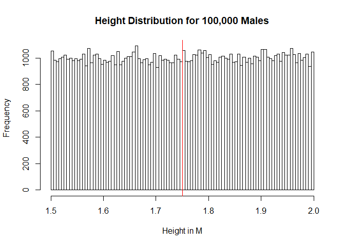
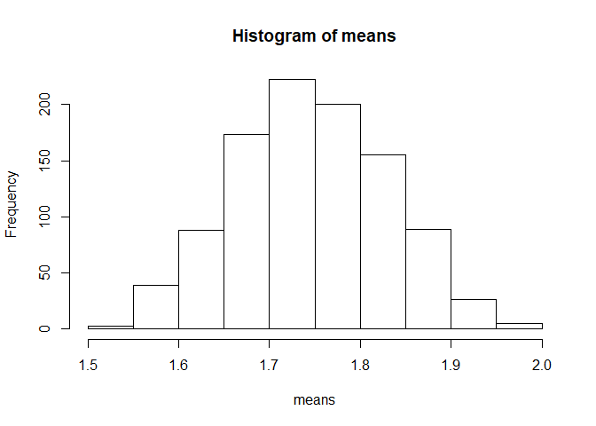
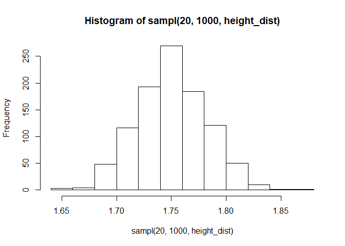
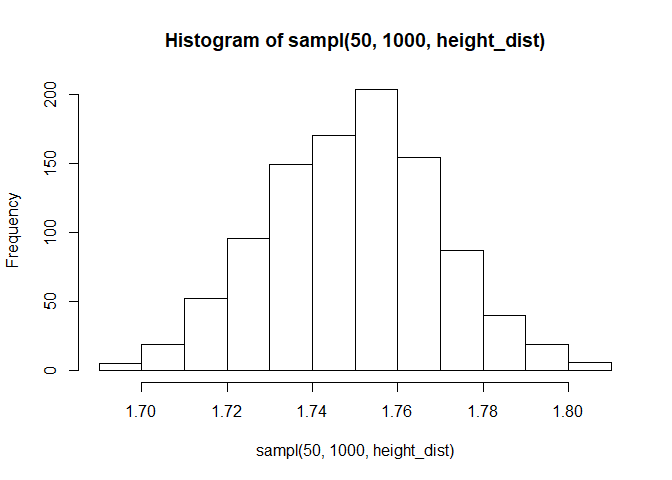

Central Limit Theorem
================

# Exploration of the Central Limit Theorem

The Central Limit Thereom is one of the most fundamental concepts in
statistics. In this document, I will be visualizing the central limit
theorem to better drive my understand of this concept. The theorem
itself revolves around the sampling process, in which we try to
approximate the distribution of the population by drawing values from
the whole population. The underlying assumption that we cannot sample
the whole population, so we sample until we feel that we have an
accurate estimation of our population.

For this example, we will assume our population is 100,000 males that
live in a hypothetical country. We can say that the height of all the
males ranges from 1.5 m (\~4.9 feet) to 2 m (\~6.6 feet). Our population
follows the following distribution (mean is shown by a vertical red
line):

``` r
height_dist <- runif(100000, 1.5, 2)
mean_height <- mean(height_dist)
hist(height_dist, 
     main = 'Height Distribution for 100,000 Males',
     xlab = 'Height in M',
     breaks = 100)
abline(v=mean_height,col="red")
```

<!-- -->

Given this population, we hope to run an experiment to try and
approximate this distribution. Since we “can’t” sample all 100000 males,
we decide our best course of action is to complete simple random
sampling (SRS). Below is a function to create samples with size N for
reps repetitions from a distribution dist:

``` r
# Function takes the sample size N, the number of sampling repetitions to complete and distribution to sample from

sampl <- function(n, reps, dist) {
  samples <- replicate(reps, sample(dist, n))
  sample_means <- colMeans(samples)
  return(sample_means)
}
```

Lets start with samples of size 3 for 100 repetitions from our testing
distribution:

``` r
means <- sampl(3, 1000, height_dist)
hist(means)
```

<!-- -->

This is where the central limit theorem comes into play: as we increase
our sample size (N), the resulting sampling distribution (the
distribution of our sample means) will begin to resemble the normal
distribution:

``` r
hist(sampl(10, 1000, height_dist))
```

<!-- -->

``` r
hist(sampl(20, 1000, height_dist))
```

<!-- -->

``` r
hist(sampl(50, 1000, height_dist))
```

<!-- -->

Through the proggression of the above distributions, we can see that by
only changing the sample size N, we have approximated a normal
distribution.

The reason that the CLT is one of the most fundamental and important
concepts of inteferential statistics, is that it gives us the confidence
that we can approximate the distribution of ANY population that we hope
to sample. Again, all of this is built upon the assumption that we
cannot realistically sample a whole population. Still, the question
remains, why is obtaining a normally distributed approximation of the
population important. Well the reason lies within the fact that many
other statistical/experimental practices are built upon the assumption
that the population is normally distributed. For example, linear
regression and hypothesis testing are two examples of statistical
methods that are built on assumptions of normality. Again, for someone
that has not completed such methods themselves, creating a normal
approximation might not seem important. But as your exposure to
statistical methods increases, your appreciation of the CLT will as
well.
