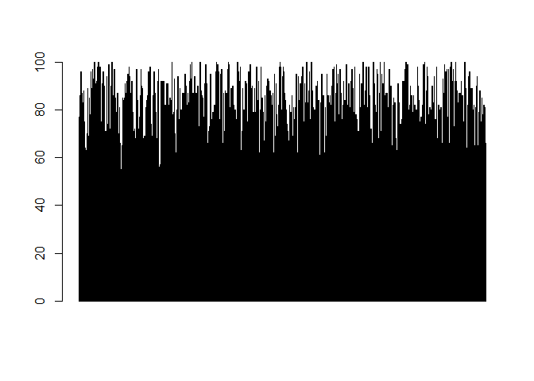
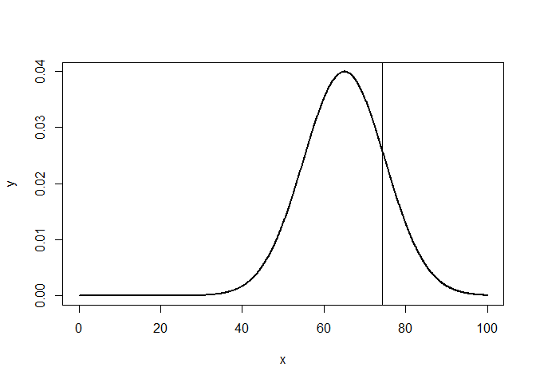
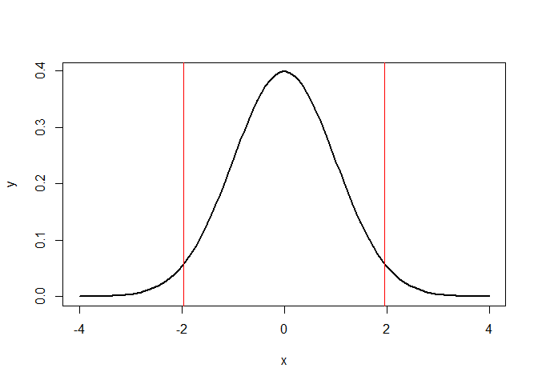

# Hypothesis Testing

In terms of statistical methods, hypothesis testing consistently tops
lists as one of the most important methods currently in existence, as
well as one of the most fundamental. Also, some other statistical
methods/experiments are built directly on top of hypothesis testing,
such as A/B tests. For this reason, it is vital to get a good
understanding of hypothesis tests before moving on to other types of
experiments. Hypothesis testing is not always an easy concept to grasp;
while the idea is quite simple and there are not many inputs in a
hypothesis test, it may take exposure to many different kinds of
hypothesis tests before the concept really “clicks”.

On the topic of A/B testing, it is a good example to understand why
hypothesis testing is useful. Without going into too much detail, say
that we have a company that is trying to test the effectiveness of two
of its website variants. One variant has been used for a while (A), but
the company feels that variant B could perform better. After letting
both variants run their course, they lazily choose variant A after
seeing it provided more profit without any further testing. It turns out
that variant B could have provided more profit, and the difference
between the two was not statistically significant (will be explained
later). In this case, the company missed out on what could be a huge
amount of profit. Business commonly use statistical testing for this
reason: data driven decisions need to be made with confidence, and
hypothesis tests help us accomplish this fact.

The main idea behind hypothesis testing revolves around two hypotheses:
the null and the alternative hypotheses. In a sense, the goal of a
hypothesis test is to ultimately reject the null hypothesis. What we are
trying to do with a hypothesis test is answer questions about our data.
We hope to use statistics to prove validity of our claims and drive data
driven decisions. The traditional hypothesis tests rests on two
assumptions: that your data is normally distributed, and that your two
samples are drawn from the population. For example, if we have a
population of all females living in the United States and we hope to
compare the average income of females living in California with females
living in New York, we can say that a big enough sample will satisfy
both of these assumptions (the Central Limit Theorem helps with the
first assumption and both samples are drawn from the population of all
females living in the United States).

There is heavy importance placed on wording when analyzing hypothesis
tests, for example, we can never explicitly “accept” the alternate
hypothesis. The two results of a hypothesis test are limited to
rejecting the null hypothesis (accepting the null hypothesis is false),
and failing to reject the null hypothesis (accepting the null hypothesis
is true). The reason that we cannot accept a hypothesis will be
explained in the discussion of the p-value.

Lets begin an example of a hypothesis test. Say we have a population of
all students (5,000) in a university who have taken a placement exam.
The exam is scored from 0-100, but all students scored above 50/100. Two
teachers from the class are studying the results of the school, and want
to see if the results of their school did worse than the national
average of 65% (which would result in a revamp of their preparation
program):

``` r
scores <- sample(50:100, 1000, replace=T)
bp <- barplot(scores)
```

<!-- -->

``` r
school_mean <- mean(scores)
```

    ## [1] "The mean test score for this school was 75.094%"

Every hypothesis test begins with a formal defintion of both hypotheses.
At this point, we choose one of two options for a hypothesis test: a one
tailed or two tailed test. If we are trying to prove a difference
between two groups, such as the difference in scores between the this
school and the national average, we can say that we have a two-tailed
test. If we are trying to prove that this school’s students had
specifically better grades than the national average, this would be a
one tailed test (will make sense once we begin looking at test statistic
ditsributions). For simplicity, lets assume we are simply trying to show
a difference between the two groups:

H<sub>0</sub>: This school’s average score is identical to the national
average (S = N)

H<sub>1</sub>: This school’s average is not identical to the national
average (S \!= N)

In a hypothesis test, H<sub>0</sub> denotes the null hypothesis while
H<sub>1</sub> denotes the alternative hypothesis. Finally, we can factor
in statistics to answer the question about this particular collection of
students. Lets sample 250 students from our school and compare their
score to the national average:

``` r
school_sample <- sample(scores, 250, replace = T)
sample_mean <- mean(school_sample)

pop_mean <- 65 

x <- seq(0, 100, length=1000)
y <- dnorm(x, mean=65, sd=10)

n <- plot(x, y, type='l', lwd=2)
abline(v=sample_mean)
```

<!-- -->

We have now established the distribution of the national average test
score, with the school’s mean shown as a vertical line. At this point,
there are two different tests that can be used to determine the
statistical significance: the t-test and the z-test. The choice of test
lies in the sample size of your test, the most accepted cutoff for the
t-test is anything less than or equal to 30. Since our sample size is
250, we will use the z-test. In this case, we want to find what is known
as the “cut-off zone” in the distribution of population test scores.
This is where the alpha/significance level comes into play. At this
point in the process of the test, we define a level that will define how
much confidence we want to have in our test: the smaller the alpha, the
more confident we want to be in our result. The generally accepted alpha
is 5% or 0.05. Lets take a look at the standard normal Z distribution to
better understand this:

``` r
x <- seq(-4, 4, length=100)
y <- dnorm(x)

n <- plot(x, y, type='l', lwd=2)
abline(v=-1.96, col='red')
abline(v=1.96, col='red')
```

<!-- -->

After defining our significance level of 5%, we look back at the setup
of the hypothesis test as a whole. Since we defined this as a two-tailed
test, our cutoff zone includes 2.5% at each tail of the normal
distribution. If the Z score of our sample mean falls outside of this
cutoff region (to the left of the left line and the to the right of the
right line), we have enough “evidence” to reject our null hypothesis.
Why? This is because if our Z score was to fall inside of the two red
lines, there is quite a large chance (large relative to our significance
level) that our null hypothesis will be true, and we should fail to
reject it. Lets do the calculations for this sample.

``` r
z <- (sample_mean-pop_mean) / (sd(school_sample)/sqrt(250))

pnorm(z)
```

    ## [1] 1

With our z score being `10.3025312`, and our defined cutoffs being +/-
1.96 (2.5% of the area of the normal curve to the right/left of each of
these points), we can see that 10.9 is MUCH larger than 1.96, and the
probability that the null hypothesis will be true is essentially 0,
based on the average score of this school as well as the sample size we
chose. For this reason, we can emphatically reject the null hypothesis.

### Values generated from the hypothesis test

After completing the hypothesis, there are 3 important numerical
measures that define the success of the test: Alpha, Beta, Power.

  - Alpha: In any hypothesis test, we can always say that alpha is equal
    to the significance level. Alpha tells us the Type I error: given
    that the null hypothesis was true, what is the probability that we
    incorrectly reject the null hypothesis. At this point, we can bring
    in the opposite of the significance level: the confidence level.
    With a significance level of 5%, our confidence level is 95%, which
    says that we want to be 95% confident in the results of the test,
    with 5% leeway left and 5% chance that we may incorrectly reject the
    null hypothesis. If we were to set an extremely small alpha, there
    is a high chance we will never be able to reject the null
    hypothesis.

  - Beta: The beta value in a hypothesis test defines the probability
    that, given a false null hypothesis, we fail to reject.

  - Power: The power of a hypothesis test is the opposite of beta
    (1-beta), and tells us that given a false null hypothesis, what is
    the probability that we correctly reject.

This is one of the more simpler examples of hypothesis testing. In the
document about A/B testing, I go in depth into a different type of
hypothesis test: the one-taild test.
