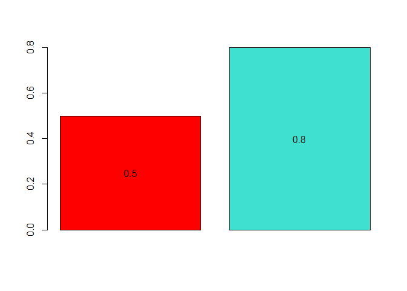
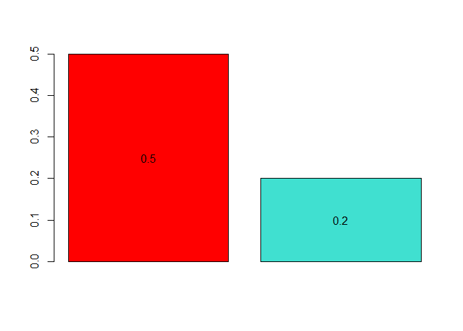
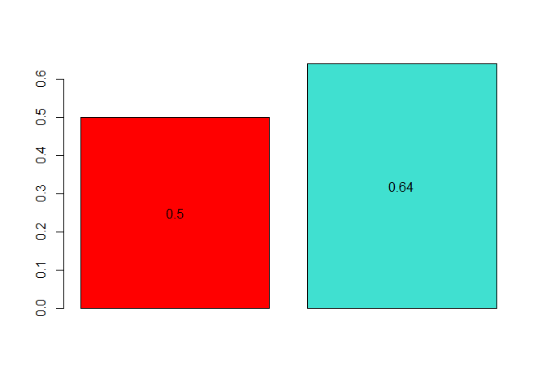
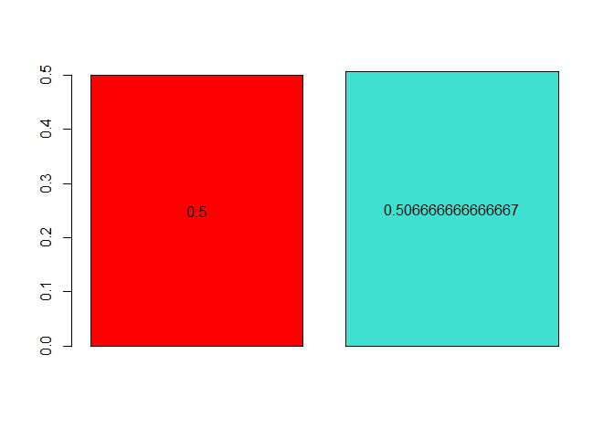
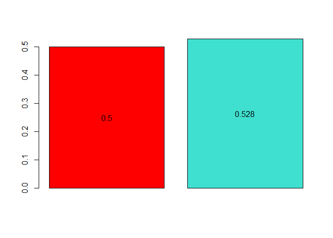

# Exploration of the Law of Large Numbers

Another fundamental idea in inferential statistics is the Law of Large
Numbers (LLN). The LLN is another theorem related to the process of
creating samples from a large population, and says that if we
incrementally increase the size of the sample we draw from a population,
the expected value (mean) of our sample will start to closely resemble
the expected value of our population. Intuitively, this makes sense. As
we continue to draw more and more samples from our population, we can
expect that our sample will begin to closely reflect our population.

The classic example of the LLN is the coin toss example. If we have a
‘fair’ two-sided coin, we expect the probability of landing either a
head or tail is exactly 50% (the word fair gives this away, in this case
fairness tells us that there is no chance that you will have a higher
chance of getting either heads or tails). Assume we are trying to find
the expected value of landing heads for some arbitrary amount of tosses,
and after 2 of these trials (flips of a coin) we land 2 tails. Our
expected value (mean) of landing heads is 0, which is obviously
significant different from the actual expected value of 0.5. With 5
trials, we can get an expected value greater than or less than 0.5, but
it is essentially impossible to get a expected value of 0.5

``` r
trials <- rbinom(5, 1, 0.5)
ls <- c(0.5, mean(trials))
bp <- barplot(ls, col = c('red', 'turquoise'))
text(bp, y=ls/2, labels=as.character(ls))
```

<!-- -->

``` r
trials <- rbinom(5, 1, 0.5)
ls <- c(0.5, mean(trials))
bp <- barplot(ls, col = c('red', 'turquoise'))
text(bp, y=ls/2, labels=as.character(ls))
```

<!-- -->

The example of receiving 2 tails from 2 trials was not meant to suggest
that a small amount of trials will always result in a smaller expected
value than the average: the above examples show a sample expected value
that is both greater than and less than the actual. As a continuation,
lets observe the affect of increasing the sample size:

``` r
trials <- rbinom(50, 1, 0.5)
ls <- c(0.5, mean(trials))
bp <- barplot(ls, col = c('red', 'turquoise'))
text(bp, y=ls/2, labels=as.character(ls))
```

<!-- -->

``` r
trials <- rbinom(150, 1, 0.5)
ls <- c(0.5, mean(trials))
bp <- barplot(ls, col = c('red', 'turquoise'))
text(bp, y=ls/2, labels=as.character(ls))
```

<!-- -->

``` r
trials <- rbinom(500, 1, 0.5)
ls <- c(0.5, mean(trials))
bp <- barplot(ls, col = c('red', 'turquoise'))
text(bp, y=ls/2, labels=as.character(ls))
```

<!-- -->

``` r
trials <- rbinom(1000, 1, 0.5)
ls <- c(0.5, mean(trials))
bp <- barplot(ls, col = c('red', 'turquoise'))
text(bp, y=ls/2, labels=as.character(ls))
```

<!-- -->

``` r
trials <- rbinom(100000, 1, 0.5)
ls <- c(0.5, mean(trials))
bp <- barplot(ls, col = c('red', 'turquoise'))
text(bp, y=ls/2, labels=as.character(ls))
```

<!-- -->

While the expected value of the sample does not always converge to the
expected value of the population linearlly, as we can see, the mean of
our sample does get closer to 0.5. Initially, a “hand wavey” version of
the law of large numbers was presented by Renassaince Era Mathematician
Gerolamo Cardano, who stated that the accuracy of trials will improve as
we increase the number of trials. The LLN as we know it today was first
proven by Jacob Bernoulli. Its importance should be clear: we are given
a clear-cut way to improve our sampling of a population. We know that as
long as we can find a “safe” way to sample from our population, we can
incrementally increase the accuracy of our sample.
